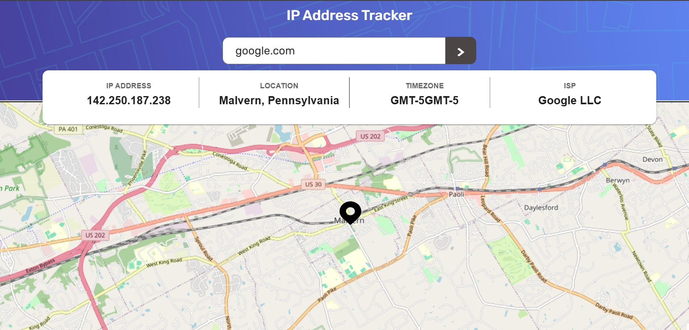

# IP Address Tracker

## Overview

The IP Address Tracker is a web application that allows users to quickly view geolocation information for any IP address . On page load, the app automatically displays the user's current IP details (location, ISP, timezone) on an interactive map. Users can also search for any IP address to retrieve up-to-date information.

## Features

- **Responsive Design:** Optimized for both mobile and desktop devices.
- **Automatic IP Lookup:** Fetches and displays your IP details on initial load.
- **Search Functionality:** Enter any IP address  to view its geolocation data.
- **Interactive Map:** Built with LeafletJS for dynamic map rendering and smooth transitions.
- **Error Handling:** Displays user-friendly error messages for invalid inputs.
- **SEO Optimization:** Meta tags are dynamically managed with React Helmet using environment variables.

## Built With

- **React** – For building the user interface.
- **Vite** – Fast, modern build tool.
- **Material UI (MUI)** – For responsive UI components.
- **Leaflet** – For interactive maps.
- **Axios** – For API requests.
- **React Helmet** – For managing dynamic meta tags.

## Getting Started

### Prerequisites

- Node.js (v14+ recommended)
- npm or yarn

### Installation

1. Clone the repository:
   git clone https://github.com/yourusername/ip-address-tracker.git
3. Install dependencies:
  npm install
4. Running Locally
  npm run dev

## Project Structure
/src
├── /Components
│   ├── HeaderSectionFolder/HeaderSection.jsx   // Contains the header (with semantic <header>) and search form
│   ├── InfoFolder/Info.jsx                       // Displays IP details (IP, location, ISP, timezone)
│   ├── MapFolder/Map.jsx                         // Renders the interactive map using Leaflet
│   ├── Loader.jsx                               // Loading indicator component
├── /utils
│   ├── fetchData.js                             // Function to fetch geolocation data using Axios
├── App.jsx                                      // Main application component
├── App.css                                      // Global styles
└── index.js                                     // Application entry point

## License
This project is open source and available under the MIT License.

Feel free to adjust any sections (like URLs or acknowledgements) to match your project specifics.
